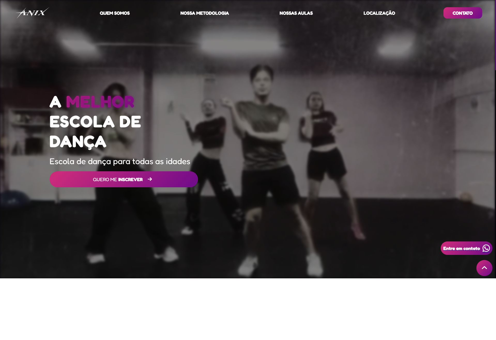

# Landing Page — ANIX Dance Studio

Landing page desenvolvida para uma escola de dança, focada em apresentação institucional e conversão de novos alunos.

## Tecnologias utilizadas

* HTML5
* CSS3
* JavaScript
* Responsividade com Media Queries

## Funcionalidades

* Menu com scroll suave
* Animações ao rolar a página
* Layout totalmente responsivo
* Integração com WhatsApp
* Integração com Google Maps
* Carrossel de imagens

## Preview

## Demonstração

Acesse o projeto online:
*(Em breve)*

## Autor

Desenvolvido por **Gustavo Rosendo**

GitHub: https://github.com/GuRosendo

---

⚠️ Projeto desenvolvido para uma empresa real. Este repositório foi publicado apenas para fins de apresentação em portfólio.
